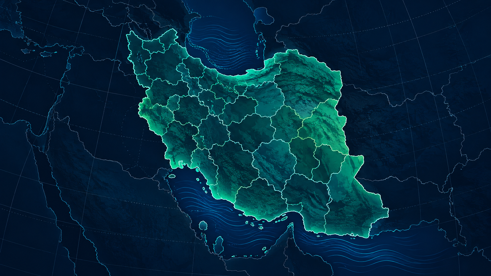

# Iran Vector Maps



Fast, accessible, data-driven SVG maps for React, with a complete Iran province and county explorer. The project includes a reusable package, a bilingual demo website, and a reproducible pipeline for verified geographic assets.

## Live demo

After GitHub Pages is enabled, visit **https://mobin-karam.github.io/iran-vector-maps/**. The demo supports Persian RTL and English LTR, province-to-county drill-down, hover labels, search, JSON/CSV data overlays, custom colors, and SVG/PNG export.

## Install the React package

```bash
npm install iran-vector-maps
```

```tsx
import { IranAdminSvgMap } from 'iran-vector-maps'
import 'iran-vector-maps/styles.css'

<IranAdminSvgMap
  data={provinces}
  values={{ 'IR-05': 12840 }}
  onRegionClick={(region) => openDetails(region.id)}
/>
```

The component is fully controlled: your application supplies GeoJSON-compatible boundaries, values, selected state, labels, colors, and click/hover handling. It uses no map tiles, remote APIs, router, GPS, iframe, or canvas.

## Run the demo locally

```bash
npm install
npm run maps:build
npm run dev
```

Run release checks with:

```bash
npm test
npm run lint
npm run build
npm run package:build
```

Static hosts need an SPA fallback to `index.html` for deep map URLs. The included GitHub Pages workflow builds the app with the correct repository base path.

## What is included

- Native, keyboard-accessible SVG rendering for `Polygon` and `MultiPolygon` geometry.
- 31 province maps and county layers loaded on demand from static TopoJSON.
- Stable region IDs, Persian/English names, tooltips, search, and province-to-county navigation.
- JSON and CSV metric import with validation, color scales, value labels, legend, and unknown-ID reporting.
- Host-controlled theme, colors, selection, details, and SVG export; the demo also offers PNG export.
- A compact package suitable for dashboards, reporting, public services, research, health, education, logistics, sales territories, and any regional dataset.

## Data and boundaries

Raw source material is intentionally kept outside version control under `data-source/`. The deployable map assets live in `public/maps/iran/` and are rebuilt with `npm run maps:build`.

Sources, attribution, scope, and known limits are documented in [DATA_SOURCES.md](DATA_SOURCES.md). Province and county polygons are derived from OpenStreetMap-based datasets; hierarchy metadata is used to match regions conservatively. Do not infer or publish a boundary that has not been verified.

## Documentation

- [Package API and release notes](packages/iran-vector-maps/README.md)
- [Data-overlay import contract](docs/ADDING_DATA_OVERLAYS.md)
- [Customization guide](docs/CUSTOMIZING_THE_MAP.md)
- [AI and application integration](docs/AI_AGENT_INTEGRATION.md)
- [Map-data update workflow](docs/UPDATING_MAP_DATA.md)
- [Implemented and planned package features](docs/PACKAGE_FEATURES.md)

## License

The application and package source code are available under the [MIT License](LICENSE). Geographic data retains the licenses and attribution obligations stated in [DATA_SOURCES.md](DATA_SOURCES.md); those terms can be more restrictive than the source-code license.

## Releases

Every Git tag matching `v*` runs the release workflow. It validates the reusable package, creates the installable `iran-vector-maps-<version>.tgz` artifact, and attaches it to the corresponding GitHub Release. Install a release artifact directly when npm is not part of your delivery flow:

```bash
npm install https://github.com/Mobin-Karam/iran-vector-maps/releases/download/v0.2.0/iran-vector-maps-0.2.0.tgz
```
